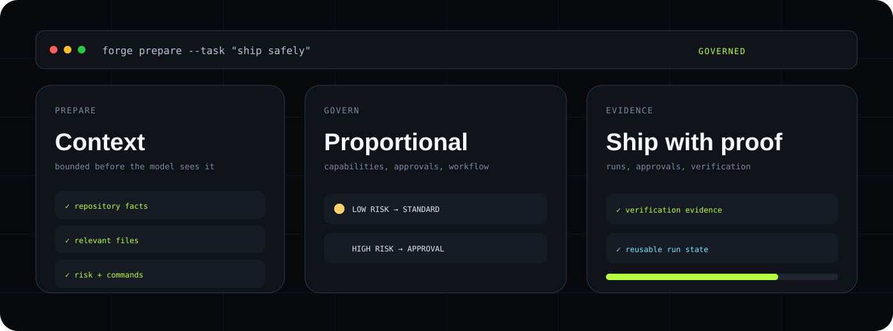
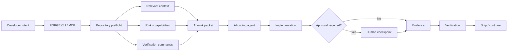
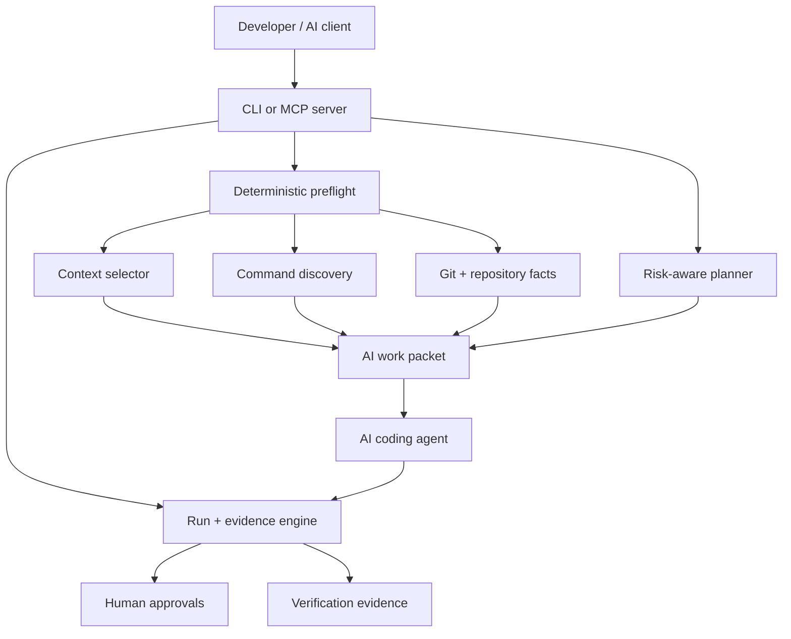

<a name="readme-top"></a>

<div align="center">



<p>
  <a href="https://github.com/gODtECH-Ctl-Create/gODtECH-FORGE/actions/workflows/cli.yml"></a>
  <a href="https://github.com/gODtECH-Ctl-Create/gODtECH-FORGE/releases/tag/v0.6.0"></a>
  
  
  <a href="./LICENSE"></a>
</p>

### Framework for Orchestrated Reasoning, Governance & Engineering

**A credit-aware control layer for deliberate, governed AI-assisted software development.**


<p>
  <a href="#-quick-start">Quick start</a> ·
  <a href="#-how-forge-works">How it works</a> ·
  <a href="#-what-you-get">What you get</a> ·
  <a href="#-ai-coding-integration">AI integration</a> ·
  <a href="#-architecture">Architecture</a> ·
  <a href="#-roadmap">Roadmap</a>
</p>

</div>

---

## ⚡ The 30-second version

**FORGE** sits between developer intent and an AI coding agent.

Instead of making the model spend paid reasoning time rediscovering a repository, FORGE performs repeatable local preparation first: repository inspection, bounded context selection, risk classification, command discovery, workflow planning, approval gating, caching, and evidence tracking.

```text
TASK + REPOSITORY
       ↓
DETERMINISTIC PREFLIGHT
       ↓
BOUNDED AI WORK PACKET
       ↓
PROPORTIONAL MODEL REASONING
       ↓
APPROVALS + IMPLEMENTATION
       ↓
EVIDENCE + VERIFICATION
       ↓
SHIP
```

FORGE is **not a model**, **not a fixed application stack**, and **not one giant prompt**. It is a local CLI, a portable `.forge/` project layer, a deterministic planning engine, and a provider-neutral MCP server.

> **v0.6 focus:** the CLI, deterministic planner, cached AI work packets, privacy-preserving efficiency metrics, resumable runs, CUE contracts, MCP server, Codex plugin, and verified GitHub release distribution are implemented. Public registry packages, native binaries, automatic trusted execution, and dedicated provider adapters remain roadmap work.

<a href="#readme-top">↑ back to top</a>

---

## 🎯 Why FORGE exists

AI coding tools are powerful, but a surprising amount of model work is mechanical rather than intelligent: finding manifests, locating relevant files, guessing test commands, re-reading project rules, reconstructing previous decisions, or loading context that never mattered.

FORGE moves the repeatable parts out of the model call so model capacity can be spent on judgment, design, implementation, and interpretation.

| Typical AI coding session | FORGE-assisted session |
| --- | --- |
| Re-scan the repository every session | Reuse fingerprinted repository facts |
| Load broad context “just in case” | Select bounded task-relevant context |
| Guess build, lint, and test commands | Discover commands from allowlisted manifests |
| Use the same model/ceremony for every task | Scale reasoning and approvals to task risk |
| Keep progress only in chat history | Persist runs, checkpoints, steps, and evidence |
| Mix instructions, assumptions, and proof | Separate context, policy, workflow, and verification |
| Recover from avoidable hallucinations later | Reduce ambiguity before implementation begins |

FORGE does **not** claim a universal fixed percentage of token or credit savings. Savings depend on the repository, task, client, and model. The engineering goal is to reduce unnecessary discovery tokens, repeated tool calls, retries, context noise, and avoidable use of expensive reasoning.

---

## 🚀 Quick start

### 1. Install the verified GitHub release

FORGE `v0.6.0` is available from the signed GitHub Release. The installers verify the release checksum before performing the global package installation.

Linux or macOS:

```bash
curl -fsSLO https://github.com/gODtECH-Ctl-Create/gODtECH-FORGE/releases/download/v0.6.0/install.sh
sh install.sh 0.6.0
forge --version
```

Windows PowerShell:

```powershell
Invoke-WebRequest https://github.com/gODtECH-Ctl-Create/gODtECH-FORGE/releases/download/v0.6.0/install.ps1 -OutFile install.ps1
.\install.ps1 -Version 0.6.0
forge --version
```

The npm registry is a separate publication channel and is **not yet published**. Contributors can still install from source:

```bash
git clone https://github.com/gODtECH-Ctl-Create/gODtECH-FORGE.git
cd gODtECH-FORGE
npm ci
npm run build
npm link
forge --version
```

### 2. Add FORGE to a project

```bash
cd /path/to/your-project
forge init --dry-run
forge init
forge doctor
forge validate
```

`--dry-run` reports conflicts before anything is written. Initialization installs the portable `.forge/` workspace and `AGENTS.md`; it does not copy the FORGE implementation into your application.

### 3. Prepare the work before the model

```bash
forge prepare --task "Add passwordless sign-in"
```

For agents and other tools:

```bash
forge prepare --task "Add passwordless sign-in" --json
```

### 4. Start a governed run

```bash
forge run start --task "Add passwordless sign-in"
forge run status
```

Higher-risk plans can stop at explicit human approval checkpoints. FORGE records workflow evidence; v0.6 does not silently execute arbitrary discovered project commands.

---

## 🌀 How FORGE works



The important boundary is simple: **deterministic tooling prepares facts; the model handles judgment.** FORGE tries to remove work the model should never have needed to do in the first place.

### What `forge prepare` does locally

A preparation pass can:

- scan application files while excluding dependencies, builds, caches, and installed FORGE files;
- detect languages and allowlisted project manifests;
- inspect Git branch, commit, dirty state, and non-secret changed paths;
- reject secret-like environment, credential, key, and secret paths from context;
- select task-relevant project context instead of indiscriminate repository loading;
- discover build, check, lint, test, type-check, and verification commands;
- classify task type, risk, capabilities, workflow, and human approval requirements;
- select a bounded set of framework references and context;
- suggest an `economy`, `standard`, or `advanced` model tier;
- cache the resulting work packet by a SHA-256 fingerprint for reuse.

### Measure the preparation layer

Every prepare call records a privacy-preserving local event. View aggregate cache reuse, preparation latency, deterministic steps, model-tier routing, and estimated context reduction with:

```bash
forge metrics
forge metrics --json
```

Events are Git-ignored under `.forge/metrics/`. They contain counts and categories—not task text, filenames, source, repository identity, Git metadata, or secrets. Token estimates use a transparent four-characters-per-token approximation and are not provider billing or guaranteed credit savings.

---

## ✨ What you get

| Area | FORGE provides |
| --- | --- |
| **Repository intelligence** | Deterministic inspection of project facts, Git state, manifests, context, and verification commands |
| **AI efficiency** | Bounded work packets, cache reuse, task-relevant context, and proportional model-tier suggestions |
| **Planning** | Task classification, risk-aware capabilities, ordered steps, workflows, and approval checkpoints |
| **Governance** | Human gates for sensitive work and explicit separation of instructions, policies, evidence, and execution |
| **Memory** | Maintained project context, decisions, resumable runs, progress, approvals, and evidence under `.forge/` |
| **Agent integration** | Provider-neutral local MCP server plus a repository-bundled Codex plugin |
| **Verification** | Discovered quality commands and evidence records without silently running arbitrary application commands |
| **Portability** | A project-owned `.forge/` layer that stays independent of the consuming application's technology stack |

<p align="center">
  
</p>

---

## 📦 Ways to use FORGE

| Mode | Status | Best for |
| --- | --- | --- |
| **Verified GitHub release** | ✅ Available | Users who want the checksum-verified packaged CLI and platform installer |
| **Source-installed CLI** | ✅ Available | Contributors, local development, and existing repositories |
| **Portable `.forge/` layer** | ✅ Available | Teams that want durable project context and governance inside the repository |
| **Generic MCP server** | ✅ Available | MCP-compatible AI coding clients |
| **Codex plugin** | ✅ Available in this repo | Codex users who want FORGE tools exposed directly |
| **GitHub template / fork** | 🧪 Possible | Framework experimentation and contributors |
| **npm / Homebrew / Scoop / native binaries** | 🗺️ Planned | Additional distribution channels |

> FORGE is open source under the Apache License 2.0. Commercial use, modification, distribution, and private use are permitted subject to the license terms.

---

## 🔌 AI coding integration

FORGE exposes its deterministic engine over a local stdio MCP server:

```bash
forge mcp serve
```

### Generic MCP configuration

```json
{
  "mcpServers": {
    "forge": {
      "command": "forge",
      "args": ["mcp", "serve"]
    }
  }
}
```

### Codex plugin

A local marketplace and plugin bundle lives under `forge/codex/`:

```bash
codex plugin marketplace add ./forge/codex
codex plugin add forge@personal
```

Start a new Codex thread after installation.

| MCP tool | What the agent receives |
| --- | --- |
| `forge_prepare` | Cached repository facts, selected context, risk, commands, and remaining model work |
| `forge_plan` | Proportional capabilities, approvals, workflow, and ordered steps |
| `forge_context` | Maintained product, technical, experience, security, and operations context |
| `forge_run_status` | Current progress, next step, approvals, and evidence for a resumable run |
| `forge_metrics` | Local cache reuse, latency, deterministic-work, and context-reduction aggregates |

These tools do not call a model, approve human gates, or silently execute arbitrary project commands. The MCP layer exposes FORGE's preparation and workflow engine; the coding client remains responsible for model execution.

---

## 🧠 Architecture



FORGE's implementation stack is deliberately independent of the consuming application's stack. The target project can be Next.js, Laravel, Django, Go, Rust, .NET, Flutter, or another reasonable technology. FORGE inspects and governs the project; it does not force that project to adopt FORGE's internal tools.

### Living project layer

```text
.forge/
├── context/          product and technical context
├── decisions/        important choices and trade-offs
├── runs/             plans, approvals, progress, and evidence
├── cache/            reusable deterministic work packets
├── metrics/          private local preparation measurements
├── workflows/        reusable procedures
├── intelligence/     selectively activated reasoning modules
├── policies/         guardrails
├── verification/     quality and release gates
└── templates/        generated project artifacts
```

### Framework repository

```text
forge/
├── assets/           README and distribution presentation assets
├── src/              CLI, planner, preflight, runs, and MCP server
├── test/             regression and protocol tests
├── scripts/          build and packaging helpers
├── framework/        assets installed into target projects
├── codex/            local marketplace and plugin
└── internal/         contributor planning
```

---

## 🧰 Command map

| Command | Purpose |
| --- | --- |
| `forge init [--dry-run] [--force]` | Safely install or refresh the portable project layer |
| `forge doctor` | Diagnose runtime and repository prerequisites |
| `forge validate [--strict]` | Validate installed files and project context |
| `forge context` | Read maintained project context |
| `forge context set --key … --value …` | Update an allowlisted scalar context field |
| `forge plan --task …` | Produce a risk-aware deterministic plan |
| `forge prepare --task …` | Build or reuse a compact AI work packet |
| `forge metrics` | Summarize local preparation efficiency and estimated context reduction |
| `forge run start --task …` | Persist a resumable workflow run |
| `forge run status [--id …]` | Read the latest or a named run |
| `forge run approve --id … --checkpoint … --by …` | Record a required human approval |
| `forge run advance --id … --evidence …` | Complete the next step with evidence |
| `forge mcp serve` | Serve provider-neutral tools over stdio |

Project-aware commands accept `--cwd <directory>`. Structured consumers can use `--json` where supported.

---

## 🛠️ Technology direction

FORGE adds technology by responsibility rather than adding every ambitious component at once.

| Technology | State | Responsibility |
| --- | --- | --- |
| **TypeScript + Node.js** | ✅ Active | CLI, orchestration, preflight, workflow state, MCP |
| **CUE** | ✅ Active | Project, module, workflow, evidence, run, and work-packet contracts |
| **GitHub Actions** | ✅ Active | Cross-platform validation and schema checks |
| **Model Context Protocol** | ✅ Active | Provider-neutral local agent tools |
| **Rust** | 🗺️ Planned | Trusted execution boundary and standalone native binaries |
| **SQLite** | 🗺️ Planned | Indexed local memory, evidence, and queryable history |
| **Tree-sitter** | 🗺️ Planned | Structural multi-language source analysis |
| **OPA + Rego** | 🗺️ Planned | Executable security and governance policy |
| **Playwright** | 🗺️ Planned | Browser, responsive, interaction, and visual verification |
| **OpenTelemetry** | 🗺️ Planned | Cost, latency, quality, and operational traces |

The current foundation stays intentionally compact: **TypeScript, Node.js, CUE, GitHub Actions, and MCP**. Heavier components should enter only when their operational value justifies their cost.

---

## 🛡️ Safety boundaries

FORGE is designed to increase agent capability without quietly removing human control.

- Initialization checks conflicts before writing and preserves project-owned state.
- Secret-like paths are excluded from generated work packets.
- Context and framework selections are explicitly bounded.
- Higher-risk plans can require recorded human checkpoints.
- MCP begins with preparation and workflow-oriented tools.
- Discovered commands are reported rather than silently executed.
- Application technology choices remain with the consuming project.
- Claims and completion should be backed by repository evidence.

---

## 🗺️ Roadmap

### Phase I · Executable foundation

- [x] Portable project contracts and CUE validation
- [x] Cross-platform CLI and safe initialization
- [x] Context management and risk-aware planning
- [x] Resumable runs, approvals, steps, and evidence
- [x] Deterministic cached AI work packets
- [x] Provider-neutral MCP server
- [x] Repository-bundled Codex plugin
- [x] Privacy-preserving local cache, latency, and context-reduction metrics
- [x] Choose an open-source license
- [x] Publish signed package and release artifacts
- [ ] Accept opt-in provider usage and retry outcomes for assisted-versus-baseline studies

### Phase II · Intelligence

- [ ] Product and market intelligence
- [ ] Research workflow and evidence quality
- [ ] Architecture and design intelligence
- [ ] Engineering, security, quality, and operations intelligence
- [ ] Adaptive packet selection informed by measured outcomes

### Phase III · Enforcement

- [ ] Rust trusted execution boundary
- [ ] Tree-sitter structural analysis
- [ ] OPA/Rego policy evaluation
- [ ] Playwright product verification
- [ ] Signed evidence and release gates

### Phase IV · Ecosystem + memory

- [ ] SQLite indexed project memory
- [ ] Dedicated Claude, Cursor, and GitHub Copilot adapters
- [ ] Plugin installation and update automation
- [ ] OpenTelemetry cost and quality traces
- [ ] Durable remote orchestration where justified

---

## 🧪 Development

```bash
npm ci
npm run check
npm test
npm pack --dry-run
```

The CLI workflow validates Linux, Windows, and macOS across supported Node versions, while the schema workflow validates bundled CUE contracts and fixtures.

Contributions should keep implementation under `forge/`, preserve the distinction between instructions and proof, and follow the issue → branch → verification → pull request → review → merge workflow documented in [`AGENTS.md`](./AGENTS.md).

---

## 📄 License

FORGE is licensed under the [Apache License 2.0](./LICENSE).

You may use, modify, and distribute FORGE, including for commercial purposes, subject to the terms of the license. Contributions intentionally submitted for inclusion in FORGE are licensed under the same terms unless explicitly stated otherwise.

---

<div align="center">

### Less discovery for the model. More evidence for the result.

**Prepare locally. Reason proportionally. Govern explicitly. Ship with evidence.**

<a href="#readme-top">↑ back to top</a>

</div>
