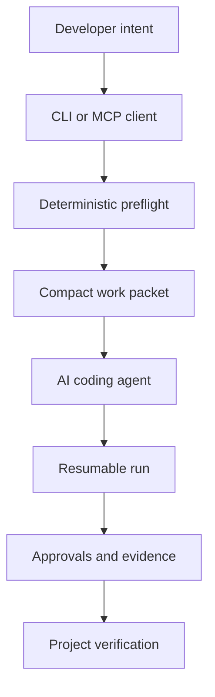

<a name="readme-top"></a>

<div align="center">

# ⚒️ FORGE

### Less discovery for the model. More evidence for the result.

**A credit-aware operating framework for deliberate, governed AI-assisted software development.**

<p>
  <a href="https://github.com/gODtECH-Ctl-Create/gODtECH-FORGE/actions/workflows/cli.yml"></a>
  
  
  
  
</p>

<p>
  <a href="#-quick-start">Quick start</a> ·
  <a href="#-how-forge-saves-ai-work">AI efficiency</a> ·
  <a href="#-ways-to-use-forge">Adoption</a> ·
  <a href="#-ai-coding-plugin">Plugin</a> ·
  <a href="#-command-map">Commands</a> ·
  <a href="#-roadmap">Roadmap</a>
</p>

</div>

---

## ⚡ The 30-second version

FORGE sits between a developer's intent and an AI coding agent. Before a model spends credits exploring a repository, FORGE performs repeatable local work: it inspects project facts, selects relevant context, classifies risk, discovers verification commands, and packages the result for the agent.

```text
TASK + REPOSITORY
       ↓
DETERMINISTIC PREFLIGHT
       ↓
COMPACT WORK PACKET
       ↓
AI REASONING + IMPLEMENTATION
       ↓
APPROVALS + EVIDENCE + VERIFICATION
```

It is not a model, a fixed application stack, or one giant prompt. It is a local CLI, a portable `.forge/` project layer, and an MCP server that compatible AI coding clients can call directly.

> **Current release:** the CLI, deterministic planner, cached AI work packets, resumable workflow records, CUE contracts, MCP server, and Codex plugin are implemented. Public registry packages, native binaries, automatic command execution, and provider-specific adapters beyond generic MCP remain future releases.

<a href="#readme-top">↑ back to top</a>

---

## 🎯 What problem does it solve?

AI coding sessions often spend paid model time rediscovering the same repository facts, loading unrelated files, guessing the intended workflow, and recovering from avoidable mistakes. A stronger model can still waste credits; a smaller model can become unreliable when the context is noisy or incomplete.

FORGE moves suitable work out of the model call.

| Without a preparation layer | With FORGE |
| --- | --- |
| Re-scan the repository in each session | Reuse a fingerprinted work packet |
| Load broad context “just in case” | Select bounded, task-relevant context |
| Guess build and test commands | Discover allowlisted commands from manifests |
| Treat every task with the same ceremony | Scale capabilities and approvals to risk |
| Rely on chat memory for progress | Persist runs, approvals, steps, and evidence |
| Let instructions and proof blur together | Separate guidance, policy, and verification |

FORGE does **not** claim a fixed 50% credit reduction. Actual savings depend on the repository, task, client, and model. The goal is measurable reduction in discovery tokens, repeated tool calls, high-tier model use, retries, and hallucination recovery.

---

## 🚀 Quick start

### 1. Install the CLI from source

The package is not yet published to npm. The current supported installation is:

```bash
git clone https://github.com/gODtECH-Ctl-Create/gODtECH-FORGE.git
cd gODtECH-FORGE
npm ci
npm run build
npm link
forge --version
```

### 2. Initialize a project

```bash
cd /path/to/your-project
forge init --dry-run
forge init
forge doctor
forge validate
```

The dry run reports conflicts before writing. Initialization installs only the portable `.forge/` workspace and `AGENTS.md`; it does not copy FORGE's source, tests, or contributor files into the target project.

### 3. Prepare work before calling a model

```bash
forge prepare --task "Add passwordless sign-in"
```

Use JSON when another tool or coding agent will consume the packet:

```bash
forge prepare --task "Add passwordless sign-in" --json
```

### 4. Start a governed run

```bash
forge run start --task "Add passwordless sign-in"
forge run status
```

High-risk plans pause at explicit approval checkpoints. FORGE records evidence; this release does not automatically execute arbitrary discovered commands.

---

## 🧠 How FORGE saves AI work

`forge prepare` performs a bounded, model-free preflight:

- scans at most 4,000 application files while excluding dependencies, builds, caches, and FORGE's own installed files;
- detects languages and allowlisted project manifests;
- reads Git branch, commit, dirty state, and up to 100 non-secret changed paths;
- excludes secret-like files such as environment, credential, key, and secret paths;
- selects only task-relevant project context;
- discovers build, check, lint, test, type-check, and verify commands;
- classifies task type, risk, capabilities, workflow, and human approvals;
- selects at most 12 framework references and 12,000 context characters;
- suggests an `economy`, `standard`, or `advanced` model tier;
- caches the packet by a SHA-256 fingerprint for reuse.

This preparation can help a capable small model behave more consistently because it receives fewer irrelevant choices and more verified facts. The model still owns judgment, implementation, and interpretation where deterministic tooling cannot.

---

## 📦 Ways to use FORGE

| Mode | Status | Best for | Important boundary |
| --- | --- | --- | --- |
| Source-installed CLI | **Available** | New or existing local projects | Requires Node.js 20+ and a source build |
| Portable `.forge/` layer | **Available** | Teams using repository instructions without the CLI at runtime | Manual upgrades until `forge upgrade` exists |
| Generic MCP server | **Available** | MCP-compatible AI coding clients | Client configuration differs by provider |
| Codex plugin | **Available from this repository** | Codex users who want direct tools | CLI must be installed on `PATH` first |
| Fork the framework repository | **Technically available** | Contributors changing FORGE itself | Not the recommended way to start an ordinary app |
| Use as a GitHub project template | **Possible, not hardened** | Experimental new-project starts | CLI initialization is safer and easier to upgrade |
| npm/Homebrew/Scoop/native binary | **Planned** | One-command machine installation | No public release is claimed yet |

### Can other people fork and reuse it?

GitHub can technically fork the repository, and the framework is designed to be reusable. However, the package currently declares `UNLICENSED` and no open-source license has been selected. That means broad reuse rights are not yet clearly granted. Choosing MIT or Apache-2.0 is a release decision that should be made explicitly before presenting FORGE as a public open-source template.

---

## 🔌 AI coding plugin

FORGE exposes the same deterministic engine over a local stdio MCP server:

```bash
forge mcp serve
```

### Generic MCP configuration

```json
{
  "mcpServers": {
    "forge": {
      "command": "forge",
      "args": ["mcp", "serve"]
    }
  }
}
```

### Codex plugin

A validated local marketplace and plugin are contained in `forge/codex/`:

```bash
codex plugin marketplace add ./forge/codex
codex plugin add forge@personal
```

Start a new Codex thread after installation.

| MCP tool | What it gives the coding agent |
| --- | --- |
| `forge_prepare` | Cached repository facts, selected context, risk, commands, and remaining model work |
| `forge_plan` | Proportional capabilities, approvals, workflow, and ordered steps |
| `forge_context` | Maintained product, technical, experience, security, and operations context |
| `forge_run_status` | Current progress, next step, approvals, and evidence for a resumable run |

The MCP tools do not call a model, edit application source, execute discovered commands, or approve human gates. `forge_prepare` may refresh its cache under `.forge/cache/`.

Claude, Cursor, GitHub Copilot, and other clients that accept local MCP servers can use the generic server command where their current configuration supports it. Dedicated provider installers and tested adapters are roadmap work; compatibility is not claimed solely because a provider mentions MCP.

---

## 🧰 Command map

| Command | Purpose |
| --- | --- |
| `forge init [--dry-run] [--force]` | Safely install or refresh the portable project layer |
| `forge doctor` | Diagnose runtime and repository prerequisites |
| `forge validate [--strict]` | Validate installed files and project context |
| `forge context` | Read maintained project context |
| `forge context set --key … --value …` | Update an allowlisted scalar context field |
| `forge plan --task …` | Produce a risk-aware deterministic plan |
| `forge prepare --task …` | Build or reuse a compact AI work packet |
| `forge run start --task …` | Persist a resumable workflow run |
| `forge run status [--id …]` | Read the latest or a named run |
| `forge run approve --id … --checkpoint … --by …` | Record a required human approval |
| `forge run advance --id … --evidence …` | Complete the next step with evidence |
| `forge mcp serve` | Serve provider-neutral tools over stdio |

Commands that operate on a project accept `--cwd <directory>`; normal output can be replaced with structured output using `--json`.

---

## 🏛️ Architecture



FORGE's implementation stack is independent of the consuming application's stack. A target project can use Next.js, Laravel, Django, Go, Rust, .NET, Flutter, or another reasonable technology. FORGE inspects and governs the project; it does not force the application to adopt FORGE's internal tools.

### Living project layer

```text
.forge/
├── context/          product and technical context
├── decisions/        important choices and trade-offs
├── runs/             plans, approvals, progress, and evidence
├── cache/            reusable deterministic work packets
├── workflows/        reusable procedures
├── intelligence/     selectively activated reasoning modules
├── policies/         guardrails
├── verification/     quality and release gates
└── templates/        generated project artifacts
```

### Compact source repository

Implementation and distribution assets stay together:

```text
forge/
├── src/              CLI, planner, preflight, runs, and MCP server
├── test/             executable regression and protocol tests
├── scripts/          build and packaging helpers
├── framework/        assets installed into target projects
├── codex/            local plugin marketplace and plugin
└── internal/         contributor planning
```

Only discovery files, package metadata, automation, licensing, and the agent entry point belong at the repository root.

---

## 🛠️ Approved technology baseline

The approved stack is being introduced by responsibility, not all at once.

| Technology | Current use | Direction |
| --- | --- | --- |
| TypeScript + Node.js | **Active** | CLI, orchestration, preflight, workflow state, MCP |
| CUE | **Active** | Project, module, workflow, evidence, run, and work-packet contracts |
| GitHub Actions | **Active** | Cross-platform Node 20/22/24 validation and CUE checks |
| Model Context Protocol | **Active** | Provider-neutral local agent tools |
| Rust | Planned | Trusted execution core and standalone native binaries |
| SQLite | Planned | Indexed local memory, evidence, and queryable history |
| Tree-sitter | Planned | Structural multi-language source analysis |
| OPA + Rego | Planned | Executable security and governance policy |
| Playwright | Planned | Browser, responsive, interaction, and visual verification |
| OpenTelemetry | Planned | Traces, metrics, and operational cost measurement |
| Python | Optional | Research and experimental analysis only where justified |
| Temporal | Optional | Durable distributed workflows only when local runs are insufficient |

This is why the early milestones use TypeScript, Node.js, CUE, GitHub Actions, and MCP now. Rust and SQLite become valuable once trusted command execution and indexed memory are mature enough to justify their operational cost.

---

## 🛡️ Safety boundaries

- Initialization checks all conflicts before writing and preserves project-owned state.
- Secret-like paths are removed from work packets.
- Context and framework selections are explicitly bounded.
- High-risk plans require recorded human checkpoints.
- MCP begins with preparation and read-oriented workflow tools.
- Discovered commands are reported, not silently executed.
- Application stack selection remains with the project.
- Generated claims should be verified against repository evidence.

---

## 🗺️ Roadmap

### Phase I · Executable foundation

- [x] portable project contracts and CUE validation
- [x] cross-platform CLI and safe initialization
- [x] context management and risk-aware planning
- [x] resumable runs, approvals, steps, and evidence
- [x] deterministic, cached AI work packets
- [x] provider-neutral MCP server
- [x] validated Codex plugin bundle
- [ ] choose an open-source license
- [ ] publish signed package and release artifacts
- [ ] measure token, latency, cache-hit, and retry baselines

### Phase II · Intelligence

- [ ] product and market intelligence
- [ ] research workflow and evidence quality
- [ ] architecture and design intelligence
- [ ] engineering, security, quality, and operations intelligence
- [ ] adaptive packet selection informed by measured outcomes

### Phase III · Enforcement

- [ ] Rust trusted execution boundary
- [ ] Tree-sitter structural analysis
- [ ] OPA/Rego policy evaluation
- [ ] Playwright product verification
- [ ] signed evidence and release gates

### Phase IV · Ecosystem and memory

- [ ] SQLite indexed project memory
- [ ] dedicated Claude, Cursor, and GitHub Copilot adapters
- [ ] plugin install and update automation
- [ ] OpenTelemetry cost and quality traces
- [ ] durable remote orchestration where justified

---

## 🧪 Development

```bash
npm ci
npm run check
npm test
npm pack --dry-run
```

The CLI workflow tests Linux, Windows, and macOS with Node.js 20, 22, and 24, plus an installed-project CUE smoke test. The separate schema workflow validates the bundled CUE contracts and fixtures.

Contributions should keep implementation under `forge/`, preserve the distinction between instructions and proof, and follow the issue → branch → verification → pull request → review → merge workflow in `AGENTS.md`.

---

## 📄 License

No open-source license has been selected yet. The package is currently marked `UNLICENSED`. Before public distribution, choose and add a license deliberately; MIT and Apache-2.0 have different patent and notice implications.

---

<div align="center">

### Prepare locally. Reason proportionally. Ship with evidence.

Maintained in the canonical [gODtECH-FORGE repository](https://github.com/gODtECH-Ctl-Create/gODtECH-FORGE).

<a href="#readme-top">↑ back to top</a>

</div>
